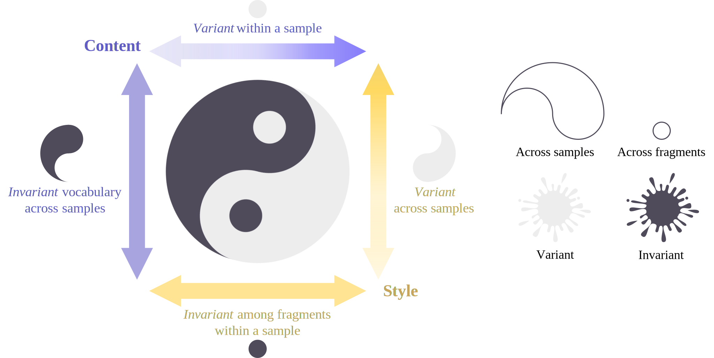

# V3 (Variance-Versus-inVariance) ✌🏼✌🏼✌🏼

[](https://arxiv.org/abs/2407.03824)
[](https://v3-content-style.github.io/V3-demo/)

*V3* is an unsupervised method that learns disentangled content and style representations from sequences of observations. Unlike most disentanglement algorithms that rely on domain-specific labels or knowledge, *V3* is based on the insight of domain-general statistical differences between content and style:

**🐣 Content varies more among different fragments within a sample but maintains an invariant vocabulary across data samples, whereas style remains relatively invariant within a sample but exhibits more significant variation across different samples.**

<p align="center">
  
</p>

This repository contains the code that implements *V3* in an encoder-decoder architecture, as well as the dataset preparation scripts and the evaluation code, as described in the paper:
> Yuxuan Wu, Ziyu Wang, Bhiksha Raj and Gus Xia. Unsupervised Disentanglement of Content and Style via Variance-Invariance Constraints. In *Proceedings of the 13th International Conference on Learning Representations (ICLR)*, 2025.

## 🗃️ Directory Structure
- `dataloader/`: scripts for loading datasets
- `dataset/`: scripts and resources for preparing datasets
  - `phonenums/`: scripts for generating written phone number sequences
  - `insnotes/`: scripts for generating monophonic note sequences played by different instruments
  - `svhn/`: scripts for preprocessing the original SVHN dataset
  - `sprites/`: scripts for generating the Sprites dataset
  - `librispeech/`: scripts for preprocessing the original Librispeech-100 dataset
- `model/`: implementation of models and loss functions
  - `modules/`: implementation of individual encoder and decoder modules
  - autoencoder.py: implementation of the 2-branch autoencoder for content and style
  - factory.py: handy entrance to create models
  - v3_loss.py: implementation of the *V3* loss
- `utils/`: helper functions for training and evaluation
- trainer.py: training script
- tester.py: evaluation script
- run_training.py: training entrance
- run_evaluation.py: evaluation entrance
- cfg*.yaml: configuration files for training preferences, hyperparameters, model checkpoints, and etc.

## ✍🏼 Data Preparation

<details>
  <summary><u>Click to expand</u></summary>
  
First make sure you are in the base directory `./`. By default, the datasets are placed outside the repository in a directory named `../data/`. You can change this path using arguments passed to scripts. There are some intermediate results during data preparation, which can be deleted after the final dataset is generated.

- **PhoneNums**: simulating handwritten phone numbers.
  - Generate images
    ```
    python -m dataset.phonenums.number_office [--save_dir <path_to_save_images>] [--n_pages <#samples_in_each_basic color>]
    ```
    You can modify this script to generate out-of-distribution images.

  - Split into training, validation, and test sets
    ```
    python -m dataset.phonenums.split_train_val [--data_dir <where_you_saved_images>] [--save_dir <path_to_save_splits>]
    ```

  - Generate the out-of-distribution dataset

    You can generate out-of-distribution samples by modifying `./dataset/phonenums/number_office.py` and redo image generation. Then run:
    ```
    python -m dataset.phonenums.split_train_val [--data_dir <where_you_saved_images>] [--save_dir <path_to_save_ood_dataset>] --split_for_ood
    ```
    which will prepare few-shot learning splits for evaluation.

- **InsNotes**: simulating monophonic notes played by different instruments.
  - Generate midi files
    ```
    python -m dataset.insnotes.gen_midi [--save_dir <path_to_save_midi>] [--n_per_ins <#samples_of_each_instrument>]
    ```
    Each instrument will play 1-second notes in an octave for two minutes.

  - Render midi files to audio files

    In this step, you need to install [FluidSynth](https://www.fluidsynth.org/) first. It's a software synthesizer that can render midi files to audio files. We use the [midi2audio](https://github.com/bzamecnik/midi2audio?tab=readme-ov-file) interface and the [GeneralUser GS](https://schristiancollins.com/generaluser.php) soundfont for synthesis (already included for you🫡).
    ```
    python -m dataset.insnotes.render_audio [--data_dir <where_you_saved_midi>] [--save_dir <path_to_save_audio>]
    ```

  - Extract audio features

    We extract Short-Time Fourier Transform (STFT) features from the audio files. The reason we use STFT features is that they introduce the **least amount of domain-specific information**.
    ```
    python -m dataset.insnotes.audio_feature_extraction [--data_dir <where_you_saved_audio>] [--save_dir <path_to_save_features>]
    ```

  - Split into training, validation, and test sets
    ```
    python -m dataset.insnotes.split_train_val [--data_dir <where_you_saved_features>] [--save_dir <path_to_save_splits>]
    ```

  - Generate the out-of-distribution dataset

    You can generate out-of-distribution samples by modifying `./dataset/insnotes/gen_midi.py` and redo synthesis and feature extraction. Then run:
    ```
    python -m dataset.insnotes.split_train_val [--data_dir <where_you_saved_features>] [--save_dir <path_to_save_ood_dataset>] --split_for_ood
    ```
    which will prepare few-shot learning splits for evaluation.

- **SVHN**: cropped digits from the [Street View House Numbers dataset](http://ufldl.stanford.edu/housenumbers/).
  - Download the original dataset

  - Parse the native SVHN annotations to .json format. The [svhnL](https://github.com/nipdep/svhnL/) package makes this possible.
    ```
    python -m dataset.svhn.parse_svhn [--data_dir <where_you_saved_SVHN>]
    ```

  - Collect samples with more than one digit and crop them from the original images
    ```
    python -m dataset.svhn.collect_plural_svhn [--data_dir <where_you_saved_SVHN>] [--save_dir <path_to_save_intermediate_results>]
    python -m dataset.svhn.crop_and_resize_svhn [--data_dir <path_of_intermediate_results>] [--save_dir <path_to_save_cropped_images>]
    ```

  - Save to .hdf5 format
    ```
    python -m dataset.svhn.svhn_to_hdf5 [--data_dir <where_cropped_images_are>] [--save_dir <path_to_save_hdf5_datasets>]
    ```

- **Sprites**: 2D sprites with different shapes and colors. Credits to [https://github.com/YingzhenLi/Sprites](https://github.com/YingzhenLi/Sprites).
  - Generate frames
    ```
    python -m dataset.sprites.random_characters [--save_dir <path_to_save_frames>]
    ```

  - Organize frames into sequences and save using the .hdf5 format
    ```
    python -m dataset.sprites.frame_to_hdf5 [--data_dir <where_you_saved_frames>] [--save_dir <path_to_save_hdf5_datasets>]
    ```
  
- **Librispeech**: cropped phonemes from the [Librispeech-100 dataset](http://www.openslr.org/12/).
  - Download the segmented dataset

    We use this phoneme-level segmentation generated by [Montreal Forced Aligner](https://montreal-forced-aligner.readthedocs.io/en/latest/): [librispeech-alignments](https://huggingface.co/datasets/gilkeyio/librispeech-alignments)
    ```
    You can download the dataset to a local directory using [huggingface-cli](https://huggingface.co/docs/huggingface_hub/main/en/guides/cli).
    ```

  - Process utterances with alignments and save to .hdf5
    ```
    python -m dataset.librispeech.huggingface_to_hdf5 [--data_dir <where_the_original_dataset_is>] [--save_dir <path_to_save_hdf5_datasets>]
    ```

</details>

## 📉 Training
Prepare your configuration .yaml file, which specifies **training and logging preferences, hyperparameters, pretrained model checkpoints**, and etc. You can find some examples in the repository. Then run the training script:

```
python run_training.py --config <path_to_your_yaml> [--name <experiment_name>] [--debug] [<other_args>]
```
You can pass additional arguments to quickly overwrite the configuration in the .yaml file.

## 📊 Evaluation
Fill in the ***active_checkpoint*** field in the configuration .yaml file with the path to the model checkpoint you want to evaluate. Then run the evaluation script, specifying the evaluation items you want to perform:
```
python run_evaluation.py --config <path_to_your_yaml> [--debug] [--pr_metrics] [--vis_tsne] [--confusion_mtx] [--zero_shot_ood] [--few_shot_ood] [<other_args>]
```
- `--pr_metrics`: calculate precision-recall metrics for content and style disentanglement. Works only for datasets with both content and style labels.
- `--vis_tsne`: visualize the t-SNE embeddings of content and style representations.
- `--confusion_mtx`: plot the confusion matrix of content and style classification.
- `--zero_shot_ood`: evaluate zero-shot OOD generalization.
- `--few_shot_ood`: evaluate few-shot OOD generalization.

You can pass additional arguments to quickly overwrite the configuration in the .yaml file. Please make sure ***model_config*** is the same as the one used for training. All outputs will be saved in the save directory as the model checkpoint.

## 🙏🏼 Cite Our Work
If you find this repository helpful, please consider citing our work:

```
@inproceedings{wu2025unsupervised,
  author    = {Wu, Yuxuan and Wang, Ziyu and Raj, Bhiksha and Xia, Gus},
  title     = {Unsupervised Disentanglement of Content and Style via Variance-Invariance Constraints},
  booktitle = {Proceedings of the 13th International Conference on Learning Representations (ICLR 2025)},
  year      = {2025},
}
```